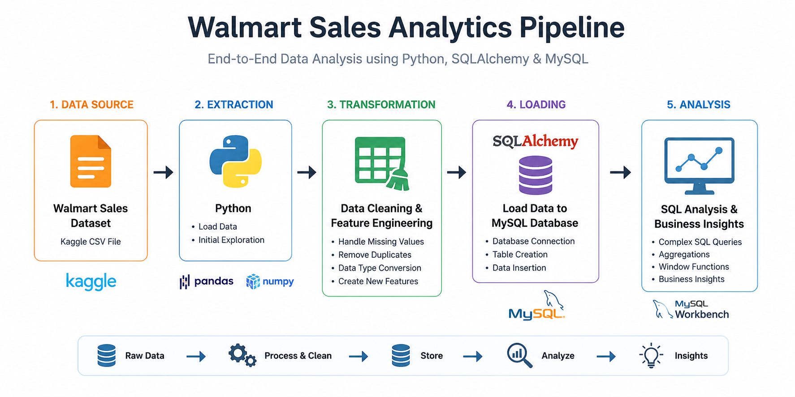

# 🛒 Walmart Sales Analytics | End-to-End Data Analysis with Python & SQL

<p align="center">
  
</p>

## 📌 Project Overview

This project demonstrates an end-to-end data analytics workflow using **Python, Pandas, SQLAlchemy, and MySQL**. Starting with a raw Walmart sales dataset downloaded from Kaggle, the data was cleaned, transformed, loaded into a MySQL database, and analyzed using SQL to answer real-world business questions.

The project showcases practical data analytics skills including data cleaning, feature engineering, ETL, SQL querying, and business insight generation.

---

## 🛠️ Tech Stack

- Python
- Pandas
- NumPy
- SQLAlchemy
- PyMySQL
- MySQL
- MySQL Workbench
- Jupyter Notebook
- Kaggle API
- Visual Studio Code

---

## 📂 Project Structure

```text
Walmart_Data_Analysis/
│
├── data/
│   ├── walmart.csv
│   └── walmart_clean_data.csv
│
├── docs/
│   └── Walmart Business Problems.pdf
│
├── notebooks/
│   └── project.ipynb
│
├── outputs/
│   ├── q1.csv
│   ├── q2.csv
│   ├── ...
│   └── q9.csv
│
├── pipeline/
│   └── walmart-project-pipeline.png
│
├── sql/
│   └── walmart_data_analysis.sql
│
└── README.md
```

---

## 📊 Dataset

**Source:** Walmart Sales Dataset (Kaggle)

The dataset contains approximately **10,000 retail transactions** across multiple Walmart branches.

### Features

- Invoice ID
- Branch
- City
- Category
- Unit Price
- Quantity
- Total Sales
- Profit Margin
- Payment Method
- Rating
- Date
- Time

---

## 🔄 Project Workflow

### 1️⃣ Data Extraction

- Downloaded the dataset using the Kaggle API.
- Loaded the CSV file into Python using Pandas.

### 2️⃣ Data Cleaning

Performed several preprocessing steps including:

- Removing duplicates
- Handling missing values
- Correcting data types
- Validating data consistency

### 3️⃣ Feature Engineering

Created additional features required for business analysis and prepared the dataset for database loading.

### 4️⃣ Database Loading

- Connected Python to MySQL using SQLAlchemy.
- Loaded the cleaned dataset into a MySQL database.

### 5️⃣ SQL Analysis

Answered multiple business questions using SQL involving:

- Aggregations
- CASE Statements
- Common Table Expressions (CTEs)
- Window Functions
- Date & Time Functions
- Ranking Functions

---

## 💼 Business Problems Solved

- Find different payment methods and total transactions.
- Identify the highest-rated category in each branch.
- Determine the busiest sales day for every branch.
- Calculate total quantity sold by payment method.
- Find the highest-rated category in each city.
- Calculate total profit generated by each category.
- Determine the preferred payment method for every branch.
- Categorize sales into Morning, Afternoon, and Evening shifts.
- Compare yearly branch revenue and identify performance trends.

The SQL queries and outputs are included in the repository.

---

## 🧠 SQL Concepts Used

- SELECT
- WHERE
- GROUP BY
- ORDER BY
- Aggregate Functions
- CASE Statements
- Common Table Expressions (CTEs)
- Window Functions (`RANK()`)
- Date Functions
- String Functions
- Joins
- Aliases

---

## 📈 Key Insights

- Identified the most profitable product categories.
- Determined branch-wise preferred payment methods.
- Analyzed customer purchasing behavior by sales shift.
- Compared branch revenue across different years.
- Identified the busiest sales periods.
- Evaluated branch-wise category performance.

---

## 📁 Outputs

The **outputs/** directory contains the result of every business problem as CSV files.

| File | Description |
|------|-------------|
| q1.csv | Payment method analysis |
| q2.csv | Highest-rated category by branch |
| q3.csv | Busiest sales day by branch |
| q4.csv | Quantity sold by payment method |
| q5.csv | Highest-rated category by city |
| q6.csv | Profit by category |
| q7.csv | Preferred payment method by branch |
| q8.csv | Sales by shift |
| q9.csv | Revenue comparison |

---

## 🚀 Skills Demonstrated

- Data Cleaning
- Exploratory Data Analysis
- Feature Engineering
- ETL Pipeline
- Database Management
- SQL Querying
- Window Functions
- Business Analytics
- Data Processing using Python

---

## ▶️ How to Run

Clone the repository

```bash
git clone https://github.com/PulkitBhardwaj20/Walmart_Data_Analysis.git
```

Install the required libraries

```bash
pip install pandas numpy sqlalchemy pymysql kaggle
```

Open

```text
notebooks/project.ipynb
```

Run the notebook to reproduce the complete workflow.

---

## 🔮 Future Improvements

- Interactive Power BI Dashboard
- Tableau Dashboard
- Sales Forecasting using Machine Learning
- Automated ETL Pipeline
- Interactive KPI Dashboard

---

## 🙏 Acknowledgements

- Walmart Sales Dataset (Kaggle)
- Built as a portfolio project to demonstrate end-to-end data analytics using Python and SQL.

---

## 📄 License

This project is licensed under the MIT License.
